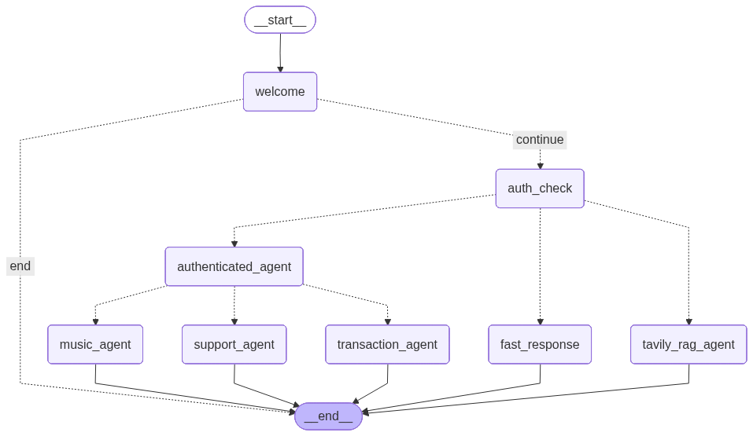
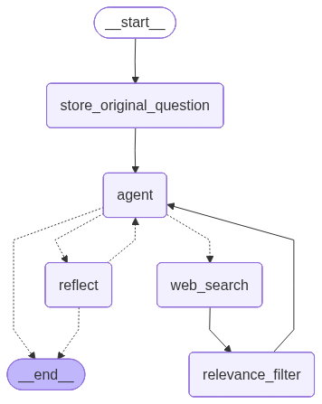

#  LangChain Music Store Customer Support Bot

A sophisticated customer support application built with LangGraph, featuring specialized agents for music recommendations, transaction management, and customer support with comprehensive PII protection.

##  Quick Start with Docker

### Build and Run the Application

```bash
# Set ENV Variables in .env file at root
LANGCHAIN_PROJECT="music-store-support-bot"
LANGCHAIN_ENDPOINT=https://api.smith.langchain.com
LANGCHAIN_TRACING_V2=true
DATABASE_PATH=./chinook.db

# *Will be included in email with limit and expiration*
LANGCHAIN_API_KEY=******
OPENAI_API_KEY=******
TAVILY_API_KEY=******
```

```bash
# Build the Docker image (this takes 5 minutes or so)
docker build -t langchain-music-store .

# Run the application
docker run -p 8501:8501 langchain-music-store
```

The application will be available at `http://localhost:8501`

## Design Notes:
- I chose to develop a support bot for a digital music store. I found a database with customers/employees/songs/albums/invoices etc online and thought it was a nice complete set of data that suited a chatbot well. This could be used for any business of course, it uses a tavily agent as well for additional web searching with a RAG relevance check on the responses, I wanted unauthenticated users to have some capabilities. Authentication is just done by inputting an email, since this is just a demo app this seemed fine but would need to be updated in production. Once authed it has several tools to look up user specific data around transactions and music recomendations. PII redaction is used to ensure the address, telephone and zip code are never returned for the user when querying for customer data. The country/state of the user is returned however as that felt more general. I created a dataset around returning order history which has some evals checking to make sure we have appropriate information in the final message. 

## System Architecture

### Main Components
- **Customer Authentication Layer** - Secure email-based authentication
- **Music Recommendation Agent** - Personalized music discovery and recommendations
- **Transaction Management Agent** - Order history and billing support
- **Customer Support Agent** - General account assistance and escalation
- **Tavily RAG Agent** - Web search for unauthenticated users

### Key Features
-  Secure customer authentication
-  PII Redaction Middleware for user privacy
-  Personalized music recommendations
-  Order history and billing support
-  Full LangSmith monitoring

##  Agent Graph Visualizations

### Music Recommendation Agent


**Notes:**
The agent goes from welcome to authenticated or not. Depending on authentication it has a series of subagents it can choose to use appropriate tools which share information from the database. It also has a quick response for messages that are short and wouldn't have much intent in them. The idea there was to decrease latency for messages that lack any depth. 

---

### Tavily RAG Agent


**Notes:**
If a user is not logged in they can do a Tavily RAG search which searches the web for answers and filters them out by relevance to try to find the right answer. A query is made to the Tavily API and the results are passed through a relevance filter to ensure they are valid and pertain to modern day responses. The relevent responses are then additionally queried to ensure they are helpful towards the response of the question. We use LLM as a judge for relevence and helpfulness checks. There's a max limit of 2 cycles of information to ensure a somewhat timely response(I didn't want anything to take more than 60 seconds).

---

##  Sample Test Customers

Use these customer emails for testing:
- `luisg@embraer.com.br`
- `leonekohler@surfeu.de`
- `ftremblay@gmail.com`
- `bjorn.hansen@yahoo.no`
- `frantisekw@jetbrains.com`

##  Usage Examples

1. **Authentication**: Enter a customer email to authenticate
2. **Music Recommendations**: "Recommend music like jazz" or "Find albums similar to The Beatles"
3. **Order History**: "Show me my order history" or "What did I purchase last month?"
4. **General Support**: "Help with my account" or "Update my profile information"

## =' Development

### Environment Setup
The application requires the following environment variables:
- `OPENAI_API_KEY` - For LLM functionality
- `TAVILY_API_KEY` - For web search capabilities
- `LANGCHAIN_TRACING_V2=true` - For LangSmith monitoring
- `LANGCHAIN_PROJECT=music-store-support-bot` - LangSmith project name

### PII Protection
The system includes comprehensive PII middleware that:
- Protects customer emails, phone numbers, and addresses
- Uses minimal protection for transaction agents to preserve financial data
- Allows order totals and purchase amounts to display properly

##  Testing and Quality Assurance

### Order History Validation
- Uses LLM-as-judge evaluation to ensure order information is properly displayed
- Validates that PII middleware doesn't block legitimate financial data
- Tests against real conversation datasets

### PII Redaction Testing
- Comprehensive tests for phone number, address, and email protection
- Validates appropriate redaction across different agent types
- Ensures financial data remains visible for transaction history

### Future Improvements
- Make embeddings to go along with my rag architecture 
- Improve flow of tool selection, right now doing string search is not great
- Summarization/Condensing node after message length gets too long
- Spent more time with our database patterns including using something like Postgres to allow for more tools 
- Code cleanup (class inheritence for shared values in agents, be more DRY, various middlewares for authorization)
- Use an ORM for DB queries

### Run Tests 
```bash
# All
pytest tests/ -v

# Specific
pytest tests/test_order_history.py -v

```